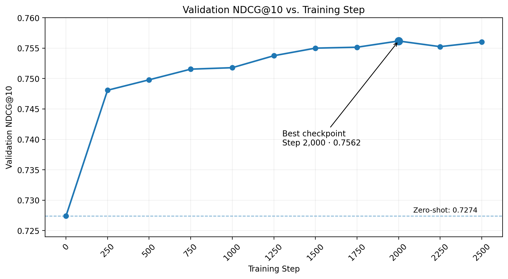

# Job–Candidate Semantic Ranking

Experiments on semantic job–candidate matching using sparse retrieval,
bi-encoder fine-tuning, hard-negative mining, and graded relevance supervision.

The project began with the TalentCLEF Task A job-to-resume ranking benchmark
and was later extended to the larger Profile-Jobs-Ranked dataset to study
ranking under a more robust train/validation/test setting.

## Overview

This project studies semantic matching between candidate profiles and job
descriptions.

The experiments are organized into two stages:

1. **TalentCLEF** — a small-data benchmark used to compare BM25, zero-shot
   dense retrieval, random-negative fine-tuning, and hard-negative fine-tuning.

2. **Profile-Jobs-Ranked** — a larger graded-relevance dataset used to train
   and evaluate bi-encoders with a proper train/validation/test split.

The main questions are:

- How much does dense retrieval improve over lexical BM25?
- Do hard negatives provide better supervision than random negatives?
- Does bi-encoder fine-tuning improve ranking on a larger dataset?
- Can continuous relevance grades provide better supervision than fixed-margin
  triplet loss?

  

## Project Structure

```
talentclef-ranking/
├── data/         # TalentCLEF Task A data (not committed - see Data below)
├── src/          # core library code (BM25, bi-encoder, evaluation metrics, data loading)
├── scripts/      # runnable entry-point scripts
├── results/      # model outputs, metrics, artifacts
├── notebooks/    # exploratory notebooks
├── tests/        # unit and integration tests
├── README.md
└── requirements.txt
```

## Setup

```bash
python3 -m venv .venv
source .venv/bin/activate
pip install -r requirements.txt
```

## Data

Expects the TalentCLEF Task A English development split (queries, corpus, qrels) under `data/TaskA/development/en/`. The dataset is excluded from version control (`.gitignore`) since it's large and subject to redistribution restrictions — download it separately from the TalentCLEF shared task and place it at that path.

## Baselines

**BM25** (`src/bm25.py`, no external dependencies):

```bash
python scripts/evaluate_bm25.py
```

**Zero-shot bi-encoder** (`sentence-transformers/all-mpnet-base-v2`, `src/bi_encoder.py`):

```bash
python scripts/evaluate_bi_encoder.py
```

Both report Recall@10, Recall@50, MRR, and NDCG@10 (`src/evaluation.py`) over all 10 development queries and save to `results/bm25_dev.json` / `results/bi_encoder_dev.json`.

## Bi-Encoder Fine-Tuning with Hard Negatives

`all-mpnet-base-v2` was fine-tuned as a bi-encoder for job-to-resume retrieval using triplet loss. The initial experiments went through several iterations after diagnosing unstable training and weak generalization.

The final training recipe used:

- **Static hard-negative mining:** for each training query, rank the full resume corpus with the zero-shot bi-encoder and sample high-ranked non-relevant resumes as negatives.
- **Triplet loss with a 0.2 margin:** a smaller margin produced more stable optimization than the initial setting.
- **Low learning rate (`1e-6`)** to avoid aggressively changing the pretrained embedding space.
- **Gradient clipping** to stabilize updates.
- **Near-duplicate filtering** to reduce the risk of sampling false negatives.

### Fixing Evaluation Leakage

An earlier version evaluated the held-out query periodically during training and restored the checkpoint with the highest held-out NDCG@10.

Although this produced strong results, it introduced **test-set leakage**: the held-out query was effectively being used as validation data for checkpoint selection.

To obtain a cleaner estimate of generalization, checkpoint selection was replaced with a **fixed-step 10-fold Leave-One-Query-Out (LOQO) protocol**:

1. Hold out one of the 10 queries as the test query.
2. Train on the remaining 9 queries.
3. Initialize each fold independently from the original `all-mpnet-base-v2` checkpoint.
4. Train for a fixed **40 steps**, with no evaluation on the held-out query during training.
5. Evaluate the held-out query exactly once after training.
6. Repeat for all 10 queries and aggregate the metrics.

This ensures that the test query does not influence training duration or checkpoint selection.

Run it with:

```bash
python scripts/train_bi_encoder_loqo.py             # hard-negative fine-tuning, all 10 folds
python scripts/train_bi_encoder_loqo_random_neg.py  # random-negative counterpart, same protocol
python scripts/compare_loqo_results.py              # side-by-side comparison against BM25 / zero-shot
```

Each sweep saves per-fold results incrementally to `results/loqo_full_sweep.json` / `results/loqo_full_sweep_random_neg.json` (so an interrupted run doesn't lose completed folds) and fine-tuned checkpoints to `results/checkpoints/`.


## TalentCLEF Experiments

### Results

| Model | Recall@10 | Recall@50 | MRR | NDCG@10 |
|---|---:|---:|---:|---:|
| BM25 | 0.2763 | 0.7970 | 0.9200 | 0.8941 |
| Zero-shot MPNet | 0.2893 | 0.7966 | 1.0000 | 0.9640 |
| Random-negative MPNet | 0.2955 | 0.8037 | 1.0000 | 0.9768 |
| **Hard-negative MPNet** | **0.2986** | **0.8112** | **1.0000** | **0.9873** |

All fine-tuned models use the same fixed 40-step LOQO evaluation protocol.

Hard-negative fine-tuning produced the strongest aggregate ranking results,
suggesting that high-ranked but non-relevant resumes provide more informative
training signals than uniformly sampled negatives.

MRR remained at 1.0 across all three conditions, indicating a ceiling effect: the first relevant resume was already ranked first for nearly every query. Recall and NDCG therefore provide more informative comparisons for this benchmark.

### Takeaway

Dense retrieval substantially improved ranking quality over BM25, while fine-tuning provided additional gains. Hard-negative fine-tuning achieved the strongest overall results, reaching 0.9873 mean NDCG@10 compared with 0.8941 for BM25, 0.9640 for zero-shot MPNet, and 0.9768 for random-negative fine-tuning. The advantage of hard negatives was most apparent on difficult queries, suggesting that training against plausible but non-relevant candidates provides more informative ranking supervision than uniformly sampled negatives.

Because TalentCLEF contains only 10 labeled queries and several queries already have near-perfect zero-shot NDCG@10, these results should be interpreted as a **small-data ablation study rather than definitive evidence of generalization**. A larger query-level dataset is needed for more robust train/validation/test evaluation.


## Scaling to Profile-Jobs-Ranked

TalentCLEF was useful for studying retrieval and negative sampling, but its
English development split contains only 10 labeled queries. This makes it
difficult to construct a conventional train/validation/test evaluation and
limits the conclusions that can be drawn from fine-tuning experiments.

To evaluate the approach at a larger scale, I extended the project to
**Profile-Jobs-Ranked**, which provides graded profile–job relevance judgments.

Unlike binary relevance labels, each judged profile–job pair has a relevance
grade from 0 to 100. The candidate jobs were retrieved before grading, so the
dataset contains plausible candidates with varying degrees of relevance rather
than simply random unrelated negatives.

Profiles are split at the **profile level** so that all candidate jobs associated
with a profile remain in the same train, validation, or test partition.


### Fixed-Margin Triplet Baseline

The initial large-scale baseline fine-tunes
`sentence-transformers/all-mpnet-base-v2` using fixed-margin triplet loss.

#### Training configuration

| Parameter | Value |
|---|---:|
| Model | `all-mpnet-base-v2` |
| Triplets | 19,893 |
| Batch size | 8 |
| Learning rate | 1e-6 |
| Triplet margin | 0.2 |
| Negatives per positive | 4 |
| Positive grade threshold | 61 |
| Minimum positive-negative grade gap | 20 |
| Gradient clipping | 1.0 |
| Maximum steps | 2,500 |
| Validation interval | 250 steps |

### Training Budget Selection

The initial pilot used a 1,000-step training budget. Its best validation
checkpoint occurred at step 950, close to the training boundary, suggesting
that the model might not yet have reached a plateau.

I therefore extended the budget to 2,500 steps and evaluated every 250 steps
on the full validation set.

| Step | Validation NDCG@10 |
|---:|---:|
| 0 (zero-shot) | 0.7274 |
| 250 | 0.7481 |
| 500 | 0.7498 |
| 750 | 0.7515 |
| 1,000 | 0.7518 |
| 1,250 | 0.7538 |
| 1,500 | 0.7550 |
| 1,750 | 0.7552 |
| **2,000** | **0.7562** |
| 2,250 | 0.7552 |
| 2,500 | 0.7560 |

Performance continued improving beyond 1,000 steps but largely plateaued
around 1,500–2,000 steps. Step 2,000 achieved the highest validation NDCG@10
and was selected before evaluating the test set.




### Test Results

| Model | Recall@10 | Recall@50 | MRR | NDCG@10 |
|---|---:|---:|---:|---:|
| Zero-shot MPNet | 0.4316 | 0.6603 | 0.5500 | 0.7058 |
| **Fine-tuned MPNet** | **0.4601** | **0.6603** | **0.5835** | **0.7394** |


Fine-tuning improved test NDCG@10 from **0.7058 to 0.7394**
(+0.0336 absolute, +4.8% relative) and Recall@10 from **0.4316 to 0.4601**.

Recall@50 remained unchanged, while Recall@10, MRR, and NDCG@10 improved.
This suggests that fine-tuning primarily improved the ordering of relevant
jobs near the top of the ranked candidate set rather than expanding
top-50 coverage.

## Next Experiments

The current baseline uses relevance grades only to construct triplets:
high-grade jobs are treated as positives and sufficiently lower-grade jobs
as negatives. The fixed-margin TripletLoss itself does not directly model
the magnitude of the 0–100 relevance difference.

Planned experiments therefore focus on graded-relevance-aware objectives:

1. **Adaptive-margin triplet loss** — increase the required separation as the
   relevance-grade gap increases.
2. **Weighted pairwise ranking loss** — weight ranking errors according to
   the difference in relevance grades.
3. **NDCG-aware ranking loss** — directly emphasize ranking mistakes that have
   larger impact on NDCG.
4. **Cross-dataset evaluation on TalentCLEF** — evaluate whether representations
   learned from large-scale profile–job supervision transfer to an independent
   job-to-resume benchmark.
